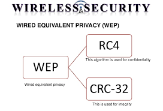
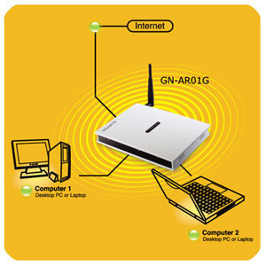
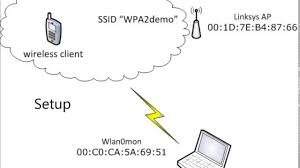

# Keamanan Jaringan Nirkabel

## 1. WEP (Wired Equivalent Privacy)

WEP adalah suatu metode pengamanan jaringan nirkabel, merupakan standar keamanan & enkripsi pertama yang digunakan pada wirelessEnkripsi WEP menggunakan kunci yang dimasukkan (oleh administrator) ke klien maupun access point. 
WEP dipilih karena telah memenuhi standar dari 802.11 yakni Exportable, Reasonably strong, Self-Synchronizing, Computationally Efficient, Optional.

### Kelebihan WEP

Saat user hendak mengkoneksikan laptopnya, user tidak melakukan perubahan setting apapun, semua serba otomatis, dan saat pertama kali hendak browsing, user akan diminta untuk memasukkan Username dan password. Hampir semua komponen wireless sudah mendukung protokol ini.

### Kelemahan WEP

Masalah kunci yang lemah, algoritma RC4 yang digunakan dapat dipecahkan, WEP menggunakan kunci yang bersifat statis, Masalah Initialization Vector (IV) WEP, Masalah integritas pesan Cyclic Redundancy Check (CRC-32).

## 2. WPA (WI-FI Protected Access)

Metoda pengamanan dengan WPA ini diciptakan untuk melengkapi dari sistem yang sebelumnya, yaitu WEP. Protokol TKIP akan mengambil kunci utama sebagai starting point yang kemudian secara reguler berubah sehingga tidak ada kunci enkripsi yang digunakan dua kali.

### Kelebihan WPA

Meningkatkan enkripsi data dengan teknik Temporal Key Integrity Protocol (TKIP). enkripsi yang digunakan masih sama dengan WEP yaitu RC4, karena pada dasarnya WPA ini merupakan perbaikan dari WEP dan bukan suatu level keamanan yang benar – benar baru, walaupun beberapa device ada yang sudah mendukung enkripsi AES yaitu enkripsi dengan keamanan yang paling tinggi.

### Kelemahan WPA

Kelemahan WPA sampai saat ini adalah proses kalkulasi enkripsi/dekripsi yang lebih lama dan data overhead yang lebih besar. Dengan kata lain, proses transmisi data akan menjadi lebih lambat dibandingkan bila Anda menggunakan protokol WEP. Belum semua wireless mendukung.

## 3. WPA2-PSK (Wi-Fi Protected Access – Pre Shared Key)

WPA2-PSK adalah security terbaru untuk wireless, dan lebih bagus dari WEP dan WPA-PSK, tetapi masih bisa untuk dicrack atau disadap tetapi sangat memakan banyak waktu.  Dalam WPA2-PSK ada dua jenis decryption, Advanced Encryption Standard (AES) dan Temporal Key Integrity Protocol (TKIP).Panjang key adalah 8-63, anda boleh memasukkan sama ada 64 hexadecimal atau ASCII (seperti biasa).

### Kelebihan WPA2-PSK

Access point dapat dijalankan dengan mode WPA  tanpa menggunakan bantuan komputer lain sebagai server, Cara mengkonfigurasikannya juga cukup sederhana

### Kelemahan WPA2-PSK

Satu satunya kelemahan WPA2-PSK adalah ketika sebuah client melakukan koneksi ke AP dimana terjadinya proses handshake, kita bisa melakukan Bruto Force yang akan mencoba satu persatu password yang ada dengan didapatkan dari proses handshake.Melakukan Bruto Force adalah melakukan dengan mengunakan dictionary file yang artinya kita harus mempunyai file berisi passpharase yang akan di coba satu persatu dengan paket handshake untuk mencari keys yg digunakan tersebut

## 4. MAC (Media Access Control) Address Filtering

MAC address adalah address fisik yang unik didalam suatu jaringan termasuk adapter wireless. MAC address ditanam secara permanen kedalam piranti jaringan. Didalam Wireless Router, kebanyakan filter wireless MAC ini secara default di  “disabled”. jika ingin mem-filter users berdasarkan MAC address, baik dilarang atau diberi ijin akses, pilih “enable”. Ilustrasi berikut ini, wireless router hanya mengijinkan komputer dengan address fisik 00-1C-F0-D9-F3-24. Karenanya untuk laptop yang ada dalam radius ini dimana address fisiknya 00-1C-F0-D9-F3-11 tidak bisa mengakses jaringan wireless.

### Kelebihan dari MAC Address Filtering
 
1. Dapat Menyeleksi Komputer / Laptop mana yang boleh masuk kedalam jaringan berdasarkan MAC Address nya.
2. Metode ini digunakan untuk membatasi hak akses dari MAC Address yang bersangkutan.
3. Alamat MAC Address harus didaftar dulu agar bisa terhubung dengan jaringan sehingga memperkecil hal-hal yang tidak diinginkan oleh yang tidak bersangutan.

### Kelemahan dari MAC Address Filtering
 
1. MAC Address bisa diketahui dengan software “KISMAC”
2. Apabila MAC Address sudah diketahui, bisa ditiru dan tidak konflik walau ada banyak   MAC Address yang sama yang terkoneksi dalam satu Access Point.
